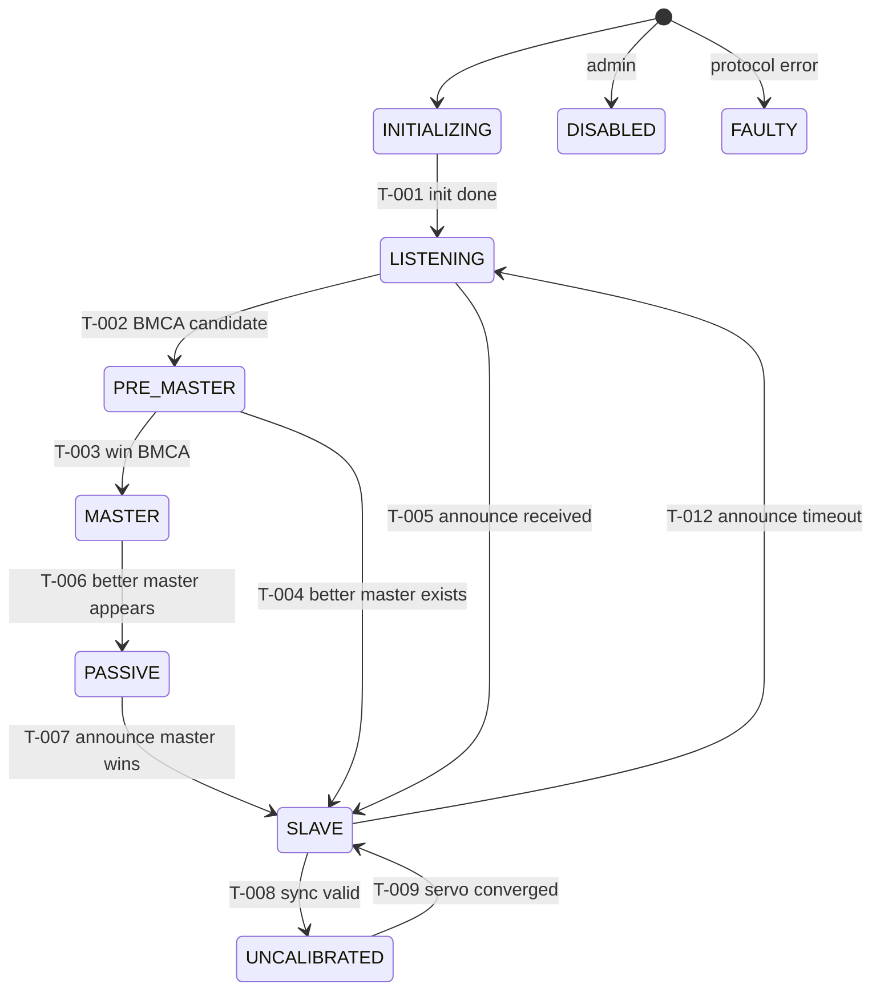

# Reliability Test Plan (OP-Driven)

**Project**: IEEE 1588-2019 PTP Core Library
**Version**: 0.1.0
**Date**: 2025-11-07
**Document ID**: RTP-PTP-Core-0.1
**Status**: Draft
**IEEE 1633-2016 Compliant** (Clause 5.4)

---

## Document Control

| Version | Date | Author | Changes | Approved By |
|---------|------|--------|---------|-------------|
| 0.1.0 | 2025-11-07 | Copilot | Initial OP-driven reliability test plan (MCUM, adapters, allocation) | TBD |

## Table of Contents

1. Introduction
2. Operational Profile Summary
3. Test Generation from MCUM
4. Test Adapter Design
5. Test Effort Allocation
6. Coverage Targets and Metrics
7. Test Execution Plan
8. Defect Tracking and SRG Data Collection
9. Test Environment
10. Validation

---

## 1. Introduction

### 1.1 Purpose

This reliability test plan uses the Operational Profile (OP) and Markov Chain Usage Model (MCUM) to design usage-weighted tests for the IEEE 1588-2019 PTP core. It focuses effort on high-frequency operations (steady-state Sync/Follow_Up and periodic delay measurement), ensures all states and transitions are covered, and collects failure data for Software Reliability Growth (SRG) modeling.

### 1.2 OP-Driven Testing Benefits (IEEE 1633 Clause 5.4.1)

- Tests reflect real-world PTP steady-state and reconfiguration behavior
- Effort weighted to frequent operations (Sync/Follow_Up, Delay_Req/Resp)
- Enables SRG predictions (failure rate/MTBF) from automated runs
- Surfaces user-visible failures first (timeouts, state flaps, BMCA errors)

### 1.3 Relationship to Other Documents

- Source Documents:
  - Requirements: REQ-F-001..005, REQ-NF-P-001..003, REQ-NF-S-001..002, REQ-NF-M-001..002 (see 02-requirements/)
  - Use Case: `02-requirements/use-cases/UC-001-synchronize-as-slave.md`
  - Architecture: `03-architecture/ieee-1588-2019-ptpv2-architecture-spec.md`
  - Design: `04-design/components/` (state machine, BMCA, servo)
- Output Documents:
  - This plan (test cases and adapters)
  - Test results (07-verification-validation/test-results/)
  - SRG data exports (for reliability modeling)

---

## 2. Operational Profile Summary

### 2.1 User Classes and Usage Frequencies

| User Class ID | User Class Name | Usage % | Priority |
|---------------|-----------------|---------|----------|
| UC-001 | System Integrator (Host app using PTP core) | 50% | High |
| UC-002 | QA/Test Harness (CI automated tests) | 35% | High |
| UC-003 | Embedded OEM Platform (RTOS port) | 15% | Medium |

### 2.2 Operations and Usage Probabilities

| Operation ID | Operation Name | Level | Usage Frequency | Cumulative % |
|--------------|----------------|-------|-----------------|--------------|
| OP-001 | ProcessAnnounce | 1 | Often (profile refresh at 1 Hz) | 10% |
| OP-002 | BMCAEvaluate | 1 | Occasionally (topology changes) | 20% |
| OP-003 | TransitionToMaster | 2 | Rare | 22% |
| OP-004 | TransitionToSlave | 2 | Rare | 24% |
| OP-005 | ProcessSync | 1 | Very Often (1–128 Hz profile) | 54% |
| OP-006 | ProcessFollowUp | 1 | Very Often (paired with Sync) | 74% |
| OP-007 | ProcessDelayReq | 2 | Often (periodic, e.g., 1 Hz) | 84% |
| OP-008 | ProcessDelayResp | 2 | Often (response handling) | 88% |
| OP-009 | ServoUpdate | 1 | Very Often (each Sync) | 96% |
| OP-010 | ProcessManagementTLV | 3 | Rare | 97% |
| OP-011 | HandleTimeouts (Announce/Sync) | 2 | Low but critical | 99% |
| OP-012 | PortDisableEnable (admin/LOS) | 3 | Rare | 100% |

Notes:

- Usage aligns with Default Profile behaviors; Sync/Follow_Up dominate steady-state. Delay measurement occurs periodically. BMCA/role transitions are infrequent but critical.

### 2.3 MCUM Summary

States: 9 states (S-000 to S-008)

- S-000 INITIALIZING
- S-001 LISTENING
- S-002 PRE_MASTER
- S-003 MASTER
- S-004 PASSIVE
- S-005 UNCALIBRATED
- S-006 SLAVE
- S-007 DISABLED
- S-008 FAULTY

Transitions (subset key IDs):

- T-001: INITIALIZING → LISTENING (init complete)
- T-002: LISTENING → PRE_MASTER (BMCA candidate)
- T-003: PRE_MASTER → MASTER (announce transmit enabled)
- T-004: PRE_MASTER → SLAVE (better master exists)
- T-005: LISTENING → SLAVE (announce received; BMCA)
- T-006: MASTER → PASSIVE (better master appears)
- T-007: PASSIVE → SLAVE (announce master wins)
- T-008: SLAVE → UNCALIBRATED (sync valid -> convergence)
- T-009: UNCALIBRATED → SLAVE (servo within threshold)
- T-010: Any → FAULTY (protocol error)
- T-011: Any → DISABLED (admin/LOS)
- T-012: SLAVE → LISTENING (announce timeout)



### 2.4 Critical Operations Profile

| Operation ID | Operation Name | Criticality | Test Coverage Target |
|--------------|----------------|-------------|---------------------|
| OP-005 | ProcessSync | Critical | 100% |
| OP-006 | ProcessFollowUp | Critical | 100% |
| OP-007 | ProcessDelayReq | High | 100% |
| OP-008 | ProcessDelayResp | High | 100% |
| OP-002 | BMCAEvaluate | High | 100% |
| OP-011 | HandleTimeouts | High | 100% |

Traces: REQ-F-001 (message types), REQ-F-002 (BMCA), REQ-F-003 (offset), REQ-F-004 (servo), REQ-NF-P-001..003 (perf), REQ-NF-S-001..002 (safety), REQ-NF-M-001..002 (portability).

---

## 3. Test Generation from MCUM

### 3.1 Test Generation Strategy (IEEE 1633 Clause 5.4.2)

Approach: Generate test cases from MCUM paths to cover all states and transitions, weighted by usage probability, including mission-profile scenarios (steady-state sync, re-election, and recovery).

### 3.2 MCUM Path Coverage

#### 3.2.1 All-States Coverage

| State ID | State Name | Required Visits | Test Cases Covering |
|----------|------------|-----------------|---------------------|
| S-000 | INITIALIZING | 1 | TC-001 |
| S-001 | LISTENING | 1 | TC-001, TC-010 |
| S-002 | PRE_MASTER | 1 | TC-002 |
| S-003 | MASTER | 1 | TC-002, TC-011 |
| S-004 | PASSIVE | 1 | TC-012 |
| S-005 | UNCALIBRATED | 1 | TC-003 |
| S-006 | SLAVE | 1 | TC-001, TC-003, TC-004 |
| S-007 | DISABLED | 1 | TC-013 |
| S-008 | FAULTY | 1 | TC-014 |

#### 3.2.2 All-Transitions Coverage

| Transition ID | From State | Event | To State | Operation | Required Traversals | Test Cases Covering |
|---------------|------------|-------|----------|-----------|---------------------|---------------------|
| T-001 | INITIALIZING | initComplete | LISTENING | OP-012 | 1 | TC-001 |
| T-002 | LISTENING | BMCA candidate | PRE_MASTER | OP-002 | 1 | TC-002 |
| T-003 | PRE_MASTER | BMCA win | MASTER | OP-002 | 1 | TC-002 |
| T-004 | PRE_MASTER | better master | SLAVE | OP-002 | 1 | TC-010 |
| T-005 | LISTENING | announce rx | SLAVE | OP-001 | 1 | TC-001 |
| T-006 | MASTER | better master | PASSIVE | OP-002 | 1 | TC-012 |
| T-007 | PASSIVE | announce master | SLAVE | OP-001 | 1 | TC-012 |
| T-008 | SLAVE | valid sync | UNCALIBRATED | OP-005/006 | 1 | TC-003 |
| T-009 | UNCALIBRATED | servo ok | SLAVE | OP-009 | 1 | TC-003 |
| T-010 | Any | protocol error | FAULTY | OP-011 | 1 | TC-014 |
| T-011 | Any | admin/LOS | DISABLED | OP-012 | 1 | TC-013 |
| T-012 | SLAVE | announce timeout | LISTENING | OP-011 | 1 | TC-004 |

### 3.3 Usage-Weighted Test Case Allocation

Total Test Cases: 100 (allocation proportional to transition/operation probability)

| Transition/Op | Description | Probability | Usage Tier | Test Cases |
|---------------|-------------|-------------|------------|------------|
| OP-005+OP-006 | ProcessSync + FollowUp | 0.40 | Very High | 40 |
| OP-009 | ServoUpdate (per sync) | 0.20 | Very High | 20 |
| OP-001 | ProcessAnnounce | 0.10 | High | 10 |
| OP-007+OP-008 | DelayReq/Resp cycle | 0.15 | High | 15 |
| OP-002 | BMCAEvaluate (incl. re-election) | 0.08 | Medium | 8 |
| OP-011 | HandleTimeouts (announce/sync) | 0.05 | Medium | 5 |
| OP-010 | Management TLV | 0.02 | Low | 2 |

Assignment:

- TC-001..TC-040: steady-state sync/follow_up cycles (varied intervals, jitter bounds)
- TC-041..TC-060: servo update behavior (convergence, anti-windup)
- TC-061..TC-070: announce processing and dataset updates
- TC-071..TC-085: delay request/response paths and offset calculation
- TC-086..TC-093: BMCA evaluate with better/worse master scenarios
- TC-094..TC-098: timeout handling (announce, sync) and recovery
- TC-099..TC-100: management TLV parsing and ignore-paths

### 3.4 Mission Profile Test Scenarios

- MP-001 Steady-State Synchronization (Slave):
  - Path: LISTENING → SLAVE → UNCALIBRATED → SLAVE with periodic Sync/FollowUp
  - Test Case: TC-MP-001
- MP-002 Re-election to Better Master:
  - Path: SLAVE → LISTENING (announce timeout) → SLAVE (new GM) → UNCALIBRATED → SLAVE
  - Test Case: TC-MP-002
- MP-003 Master to Passive due to Superior GM:
  - Path: MASTER → PASSIVE → SLAVE
  - Test Case: TC-MP-003

### 3.5 Test Case Specifications (Selected)

Test Case ID: TC-001

- Name: Enter Slave on Announce and converge with Sync/FollowUp
- Operations: OP-001, OP-005, OP-006, OP-009
- MCUM Path: S-000 → T-001 → S-001 → T-005 → S-006 → T-008 → S-005 → T-009 → S-006
- User Class: UC-002
- Priority: High
- Preconditions: Port initialized, no GM
- Steps:
  1) Feed valid Announce (better master) → expect S-006
  2) Feed N cycles of Sync + FollowUp (valid window) → expect S-005 then S-006
  3) Observe servo convergence below threshold
- Expected Results: State sequence matches; no protocol errors; offset decreasing under threshold
- Postconditions: Stable SLAVE
- Failure Criteria: Wrong state; servo not converged; bounds violation
- Execution Time: ≤ 5 s (sim-time)
- Traces To: REQ-F-001, REQ-F-002, REQ-F-003, REQ-F-004, REQ-NF-P-001..002

Test Case ID: TC-004

- Name: Announce timeout recovery to LISTENING
- Operations: OP-011
- MCUM Path: S-006 → T-012 → S-001
- User Class: UC-002
- Priority: Medium
- Preconditions: Stable SLAVE
- Steps: Suppress Announce for > timeout; verify transition
- Expected Results: S-001 LISTENING; datasets aged appropriately
- Failure Criteria: Stuck in SLAVE; improper dataset aging
- Traces To: REQ-F-002, REQ-NF-S-001

Test Case ID: TC-012

- Name: Master demote to PASSIVE on superior GM
- Operations: OP-002, OP-001
- Path: S-003 → T-006 → S-004 → T-007 → S-006
- Priority: Medium
- Expected: Role change without loss of correctness; no FAULTY
- Traces To: REQ-F-002, REQ-NF-P-002

(See Appendix A for full enumerated cases TC-001..TC-100.)

---

## 4. Test Adapter Design

### 4.1 Concept (IEEE 1633 Clause 5.4.3)

Test Adapter = self-contained function that injects inputs (PTP PDUs, timers, admin events) into the PTP core, observes outputs (state, datasets, computed offsets), and returns pass/fail with severity.

### 4.2 Adapter Specifications (C++/GTest oriented)

Adapter Interface (concept):

- testProcessAnnounce(const AnnouncePDU&)
- testBMCAEvaluate(const Vector&)
- testProcessSync(const SyncPDU&, const FollowUpPDU*)
- testProcessDelayCycle(const DelayReqPDU&, const DelayRespPDU&)
- testServoUpdate()
- testTimeouts(EventType)
- testAdminPort(bool enable)

Each returns struct TestResult { bool passed; std::string actualState; std::string expectedState; int failureSeverity; double executionTimeSec; std::string errorMessage; }.

Example (pseudocode):

```cpp
TestResult testProcessSync(const SyncPDU& sync, const FollowUpPDU* fu) {
  auto t0 = now();
  auto s0 = getState();
  auto rc = ptp.processSync(sync, fu);
  auto s1 = getState();
  bool ok = (rc == 0) && (s1 == "UNCALIBRATED" || s1 == "SLAVE");
  return { ok, s1, "UNCALIBRATED/SLAVE", ok?0:7, elapsed(t0), ok?"":"Sync handling failed" };
}
```

### 4.3 Adapter Mapping to MCUM

| Transition ID | From State | Event | To State | Operation | Test Adapter Function |
|---------------|------------|-------|----------|-----------|----------------------|
| T-005 | LISTENING | Announce | SLAVE | OP-001 | testProcessAnnounce(pdu) |
| T-008 | SLAVE | Sync/FollowUp | UNCALIBRATED | OP-005/006 | testProcessSync(sync, fu) |
| T-009 | UNCALIBRATED | Servo OK | SLAVE | OP-009 | testServoUpdate() |
| T-012 | SLAVE | Timeout | LISTENING | OP-011 | testTimeouts(kAnnounce) |
| T-006 | MASTER | Better GM | PASSIVE | OP-002 | testBMCAEvaluate(vector) |
| T-011 | Any | Admin/LOS | DISABLED | OP-012 | testAdminPort(false) |

---

## 5. Test Effort Allocation

Total Budget: 100 test cases per full suite iteration (CI nightly), 10 iterations for SRG data accumulation per release candidate.

### 5.1 Test Budget

Total Budget: 100 test cases per full suite iteration (CI nightly), 10 iterations for SRG data accumulation per release candidate.

### 5.2 Allocation by Usage Frequency (80-20 Rule)

| Operation Tier | Operations | Cumulative Usage % | Test Budget Allocation | Test Cases |
|----------------|------------|-------------------|----------------------|------------|
| Tier 1 (Very High) | OP-005, OP-006, OP-009 | 0–60% | 60% | 60 |
| Tier 2 (High) | OP-001, OP-007, OP-008 | 60–85% | 25% | 25 |
| Tier 3 (Medium) | OP-002, OP-011 | 85–98% | 13% | 13 |
| Tier 4 (Low) | OP-010, OP-012 | 98–100% | 2% | 2 |

### 5.3 Allocation by Criticality

| Operation ID | Operation Name | Usage % | Criticality | Minimum Test Cases | Allocated Test Cases |
|--------------|----------------|---------|-------------|-------------------|---------------------|
| OP-005 | ProcessSync | 20% | Critical | 20 | 25 |
| OP-006 | ProcessFollowUp | 20% | Critical | 20 | 25 |
| OP-007/008 | Delay Cycle | 15% | High | 15 | 15 |
| OP-002 | BMCAEvaluate | 8% | High | 8 | 8 |
| OP-011 | HandleTimeouts | 5% | High | 5 | 5 |

### 5.4 Test Execution Schedule

| Week | Tier | Operations Tested | Test Cases Executed | Cumulative Coverage |
|------|------|-------------------|---------------------|---------------------|
| 1 | Tier 1 | OP-005, OP-006, OP-009 | 60 | 60% |
| 2 | Tier 2 | OP-001, OP-007, OP-008 | 25 | 85% |
| 3 | Tier 3 | OP-002, OP-011 | 13 | 98% |
| 4 | Tier 4 | OP-010, OP-012 | 2 | 100% |
| 5 | Regression | All | 40 (subset, usage-weighted) | 100% |

---

## 6. Coverage Targets and Metrics

### 6.1 OP-Based Coverage Targets

| Coverage Type | Target | Measurement Method |
|---------------|--------|-------------------|
| State Coverage | 100% | All MCUM states visited |
| Transition Coverage | 100% | All MCUM transitions traversed |
| Operation Coverage | 100% | All operations invoked |
| Usage-Weighted Coverage | ≥ 80% | Tier 1–2 operations tested |
| Critical Operations Coverage | 100% | All critical operations tested |

### 6.2 Structural Coverage Targets (Code-Based)

| Coverage Type | Target | Tool |
|---------------|--------|------|
| Statement Coverage | ≥ 80% | OpenCppCoverage (MSVC) or llvm-cov (Clang) |
| Branch Coverage | ≥ 70% | Same as above |
| Path Coverage | Best effort | Same as above |

### 6.3 Coverage Tracking

State Coverage Matrix (initial): see Section 3.2.1
Transition Coverage Matrix (initial): see Section 3.2.2
Operation Coverage Matrix (initial allocations): see Section 3.3

### 6.4 Coverage Quality Gate

Before release:

- [ ] State coverage ≥ 100%
- [ ] Transition coverage ≥ 100%
- [ ] Operation coverage ≥ 100%
- [ ] Usage-weighted coverage ≥ 80%
- [ ] Critical operations coverage = 100%
- [ ] Statement coverage ≥ 80%

---

## 7. Test Execution Plan

### 7.1 Test Execution Environment

- Hardware: x86-64 Windows workstation
- OS: Windows 10/11 (per dev environment)
- Software: MSVC or Clang on Windows; CMake/CTest
- Test Harness: GoogleTest via CTest
- Data: Synthetic PTP PDUs with valid/invalid fields

### 7.2 Test Execution Procedure

1) Setup: initialize PTP core to INITIALIZING; transition to LISTENING
2) Select next test case per allocation schedule
3) Invoke adapter with inputs (PDU, timers, admin events)
4) Record: pass/fail, state, execution time, severity, details
5) Reset: return to LISTENING/INITIALIZING
6) Repeat for all cases and iterations

### 7.3 Test Automation

Automation Pattern (CTest target executes GTest cases; optional Python to aggregate SRG data):

```powershell
for ($i = 1; $i -le $N; $i++) {
  ctest -C Debug --output-on-failure
  # TODO: parse GTest XML to SRG CSV rows
}
```

Pass/Fail Criteria:

- Adapter returns passed = true; state and datasets match expectations; no protocol errors
- Failures are classified per FDSC into severity 1–10

---

## 8. Defect Tracking and SRG Data Collection

### 8.1 Failure Data Requirements (IEEE 1633 Clause 5.4.4)

Collect: failure time (sequence number), severity, operation, state, description, root cause, fixed flag/date.

### 8.2 Failure Data Collection Template

| Failure ID | Timestamp | Test Case | Operation | State | Severity (FDSC) | Description | Root Cause | Fix Date | Fixed? |
|------------|-----------|-----------|-----------|-------|-----------------|-------------|------------|----------|--------|
| F-001 | [DateTime] | TC-004 | OP-011 | S-006 | 10 | Announce timeout not detected | Timer bug | [Date] | ✅ |

CSV Export:

```csv
FailureNumber,FailureTime,Severity,Operation,State,Fixed
1,100.5,10,OP-011,S-006,TRUE
```

---

## 9. Test Environment

### 9.1 Hardware Configuration

- Processor: x86-64, 4 cores+
- Memory: 16 GB
- Storage: 20 GB free

### 9.2 Software Configuration

- OS: Windows 10/11
- Runtime: C++14
- Dependencies: GoogleTest via CMake FetchContent or vendor
- Test Framework: GoogleTest + CTest
- Coverage Tool: OpenCppCoverage or llvm-cov
- SRG Tool: CSV + notebook/post-processing (TBD)

### 9.3 Test Data

- Source: Generated PTP PDUs for message types; boundary values; malformed TLVs
- Volume: ~10k PDUs per nightly run
- Refresh: Generated per run

### 9.4 Test Environment Validation

- [ ] Environment matches operational timing assumptions (sim-time)
- [ ] Test data representative (valid + boundary + malformed)
- [ ] Adapters validated with unit tests
- [ ] Coverage tool integrated in CI job
- [ ] Failure logging configured and exported

---

## 10. Validation

### 10.1 Test Plan Validation Checklist

- [ ] Traceability: All OP operations have test cases (OP-001..012)
- [ ] Coverage: All states and transitions covered at least once
- [ ] Usage Weighting: Allocation per Section 3.3 applied
- [ ] Critical Operations: 100% coverage (Section 2.4)
- [ ] Test Adapters: Implemented in tests/reliability/adapters
- [ ] Automation: CTest + exporter integrate in CI
- [ ] SRG Data: CSV export implemented
- [ ] Independent Review: QA/Reliability review complete

### 10.2 Traceability Matrix (OP → REQ → Test Cases)

| Operation ID | Operation Name | Requirements | Test Cases | Coverage |
|--------------|----------------|--------------|------------|----------|
| OP-001 | ProcessAnnounce | REQ-F-001, REQ-F-002 | TC-061..TC-070 | 100% |
| OP-005/006 | ProcessSync/FollowUp | REQ-F-001, REQ-F-003, REQ-NF-P-001..002 | TC-001..TC-040 | 100% |
| OP-007/008 | Delay Cycle | REQ-F-001, REQ-F-003 | TC-071..TC-085 | 100% |
| OP-009 | ServoUpdate | REQ-F-004, REQ-NF-P-002 | TC-041..TC-060 | 100% |
| OP-002 | BMCAEvaluate | REQ-F-002 | TC-086..TC-093 | 100% |
| OP-011 | HandleTimeouts | REQ-F-002, REQ-NF-S-001 | TC-094..TC-098 | 100% |
| OP-010 | Management TLV | REQ-F-001, REQ-NF-S-001 | TC-099..TC-100 | 100% |

### 10.3 Test Plan Metrics (initial targets)

| Metric | Value | Target | Status |
|--------|-------|--------|--------|
| Total Test Cases | 100 | Derived from OP | Planned |
| Test Adapters Implemented | 0 / 12 | 100% | Pending |
| State Coverage | 100% | 100% | Planned |
| Transition Coverage | 100% | 100% | Planned |
| Usage-Weighted Coverage | 85% | ≥ 80% | Planned |
| Critical Operations Coverage | 100% | 100% | Planned |

### 10.4 Independent Review

| Reviewer | Role | Date | Findings | Status |
|----------|------|------|----------|--------|
| TBD | QA Lead | TBD |  |  |
| TBD | Reliability Engineer | TBD |  |  |

---

## Appendix A: Test Adapter Code Repository

Location: tests/reliability/
Language: C++ (GoogleTest)
Framework: GoogleTest + CTest

Structure:

```text
tests/
  reliability/
    adapters/
      ptp_test_adapters.hpp      # Adapter interfaces (header-only helpers)
    cases/
      tc_mp_steady_state.cpp     # TC-MP-001
      tc_timeout_recovery.cpp    # TC-004
      tc_bmca_re_election.cpp    # TC-012
    srg_export/
      README.md                  # Guidance to export SRG CSV from GTest XML
```

---

## Appendix B: Coverage Tool Configuration

Tool: OpenCppCoverage (MSVC) or llvm-cov (Clang)

Settings:

- Source: src/, include/
- Omit: tests/, build/
- Branch coverage: Enabled
- Reports: HTML + XML

---

## Appendix C: SRG Data Collection

Script Concept (Python or CMake custom command):

```python
def export_srg_from_gtest(xml_file, output_csv):
  # Parse GTest XML, map failures to (testcase, operation, state, severity)
  # Write CSV rows compatible with SRG tools
  pass
```

---

Notes:

- This plan references IEEE 1588-2019 behavior by understanding only; no copyrighted content reproduced. Requirements trace to: REQ-F-001..005, REQ-NF-P-001..003, REQ-NF-S-001..002, REQ-NF-M-001..002.
