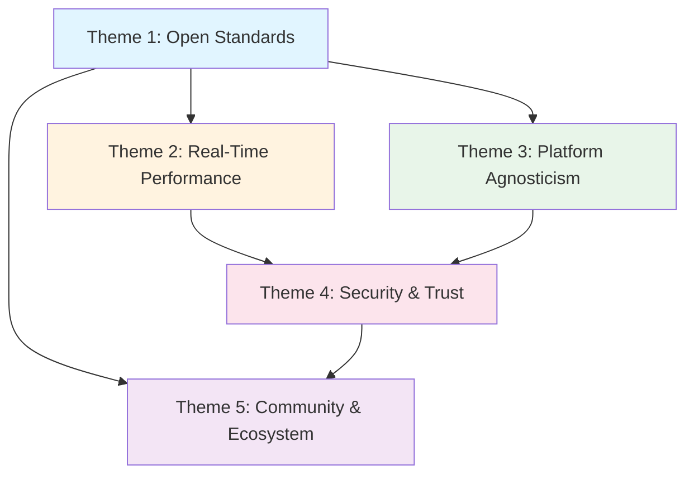

# Brainstorming Round 2: Clustering & Thematic Grouping

**Date**: 2025-11-07  
**Project**: IEEE 1588-2019 PTP Open-Source Implementation  
**Session**: Project Kickoff - Stakeholder Requirements Definition

## Theme Matrix

Based on Round 1 divergent idea generation, we've identified **5 major themes** that organize our insights:

---

### 🎯 Theme 1: **Open Standards & Interoperability**

**Core Idea**: Breaking vendor lock-in and establishing a universal, standards-compliant foundation for precision timing.

**Contributing Ideas**:
- **Problems**: Fragmentation & redundancy, proprietary stack barriers, vendor lock-in
- **Outcomes**: Cross-platform consistency, business enablement (standards claims)
- **Stakeholders**: Standards bodies, open-source maintainers, semiconductor vendors
- **Opportunities**: De-facto standard implementation, cross-industry synergy, broad interoperability
- **Constraints**: IEEE 1588-2019 strict compliance, modular HAL architecture
- **Metrics**: Conformance & interoperability testing, cross-platform coverage

**Stakeholder Needs Addressed**:
- Makers/Developers: Avoid starting from scratch
- Standards Bodies: Reference implementation for validation
- Equipment Manufacturers: Proven compliance path
- Semiconductor Vendors: Showcase hardware capabilities

**Strategic Value**: **HIGH** - Core differentiator and foundation for all other themes

---

### ⚡ Theme 2: **Real-Time Performance & Precision**

**Core Idea**: Achieving sub-microsecond, deterministic timing suitable for mission-critical applications.

**Contributing Ideas**:
- **Problems**: Inconsistent precision, real-time challenges, software-only limitations
- **Outcomes**: Improved precision & reliability (nanosecond-level), real-time safe operation
- **Opportunities**: Acceleration of innovation (advanced control algorithms)
- **Risks**: Real-time performance hurdles, hardware diversity challenges
- **Constraints**: Real-time safe design (no dynamic allocation, bounded execution), resource footprint
- **Metrics**: Synchronization accuracy (<1µs), stability & jitter (low tens of ns), performance overhead

**Stakeholder Needs Addressed**:
- Audio Equipment Manufacturers: Professional A/V sync requirements
- Industrial Automation: Control loop timing guarantees
- QA/Test Engineers: Predictable, testable behavior
- System Integrators: Performance validation and tuning

**Strategic Value**: **CRITICAL** - Must-have capability; failure disqualifies entire solution

---

### 🌐 Theme 3: **Platform & Hardware Agnosticism**

**Core Idea**: Enabling deployment across diverse hardware/OS environments from microcontrollers to servers.

**Contributing Ideas**:
- **Problems**: Platform silos (Linux-only solutions), high barrier for RTOS developers
- **Outcomes**: Cross-platform consistency, faster integration
- **Stakeholders**: Hardware/semiconductor vendors, embedded developers, operations/IT admins
- **Opportunities**: Broader adoption into IoT, robotics, home automation
- **Risks**: Hardware diversity challenges, integration complexity
- **Constraints**: Hardware-agnostic core, no OS assumptions, modular HAL
- **Metrics**: Cross-platform coverage (3-5 platforms in 6-12 months)

**Stakeholder Needs Addressed**:
- Makers/Developers: Single codebase for multiple targets
- Semiconductor Vendors: Easy integration showcasing their chips
- System Integrators: Reduced porting effort

**Strategic Value**: **HIGH** - Key enabler for market reach and adoption

---

### 🔒 Theme 4: **Security & Trust**

**Core Idea**: Building confidence through security features, code transparency, and compliance validation.

**Contributing Ideas**:
- **Problems**: Black-box proprietary implementations, certification difficulties
- **Outcomes**: Business enablement (regulatory compliance), community trust
- **Stakeholders**: Regulators & compliance officers, finance/critical infrastructure users
- **Opportunities**: Certified compliance without proprietary solutions
- **Risks**: Security vulnerabilities, attack surface in time protocols
- **Constraints**: IEEE 1588-2019 security features (optional), standards compliance
- **Metrics**: Quality & reliability (code coverage >80%, uptime metrics)

**Stakeholder Needs Addressed**:
- Regulators: Auditable, traceable timing
- Finance/Critical Infrastructure: Attack resistance
- QA/Test Engineers: Security validation tools
- Project Maintainers: Code quality and vulnerability management

**Strategic Value**: **MEDIUM-HIGH** - Essential for regulated industries, differentiator for others

---

### 👥 Theme 5: **Community & Ecosystem Growth**

**Core Idea**: Fostering an active open-source community and commercial ecosystem around the core library.

**Contributing Ideas**:
- **Problems**: Complexity & expertise gap, lack of common testbed
- **Outcomes**: Community & support, faster integration through shared HALs
- **Stakeholders**: Academic/research institutions, open-source maintainers, operations/IT admins
- **Opportunities**: Ecosystem and services (tools, support, extensions), educational use
- **Risks**: Maintenance burden, scope creep, community engagement challenges
- **Constraints**: Well-documented, modular codebase for easy contribution
- **Metrics**: Adoption & community engagement (GitHub stars, contributors, production use)

**Stakeholder Needs Addressed**:
- Academic/Research: Teaching and experimentation platform
- Project Maintainers: Sustainable contribution model
- Operations/IT: Monitoring tools and best practices
- End Customers: Confidence in community-backed solution

**Strategic Value**: **MEDIUM** - Long-term sustainability driver; grows in importance over time

---

## Cross-Theme Dependencies

**Dependency Analysis**:
- **Theme 1 (Open Standards)** is foundational - enables all other themes
- **Theme 2 (Real-Time)** depends on Theme 1 for specification correctness
- **Theme 3 (Platform Agnosticism)** requires Theme 1's HAL design principles
- **Theme 4 (Security)** builds on Themes 2+3 (secure AND performant AND portable)
- **Theme 5 (Community)** is enabled by success in Themes 1+4 (standards + trust)

---

## Theme Prioritization for MVP

Based on dependencies and strategic value:

1. **Phase 1 (MVP Foundation)**: Themes 1 + 2 + 3
   - Open Standards compliance
   - Real-Time Performance on 2-3 reference platforms
   - Platform Agnosticism via HAL architecture
   
2. **Phase 2 (Market Ready)**: Theme 4
   - Security features implementation
   - Compliance validation and documentation
   
3. **Phase 3 (Scale & Sustain)**: Theme 5
   - Community building programs
   - Ecosystem tools and services

---

## Next Steps

Proceed to **Round 3: Prioritization & Impact Analysis** to score specific features and capabilities within each theme by Impact vs. Effort.
